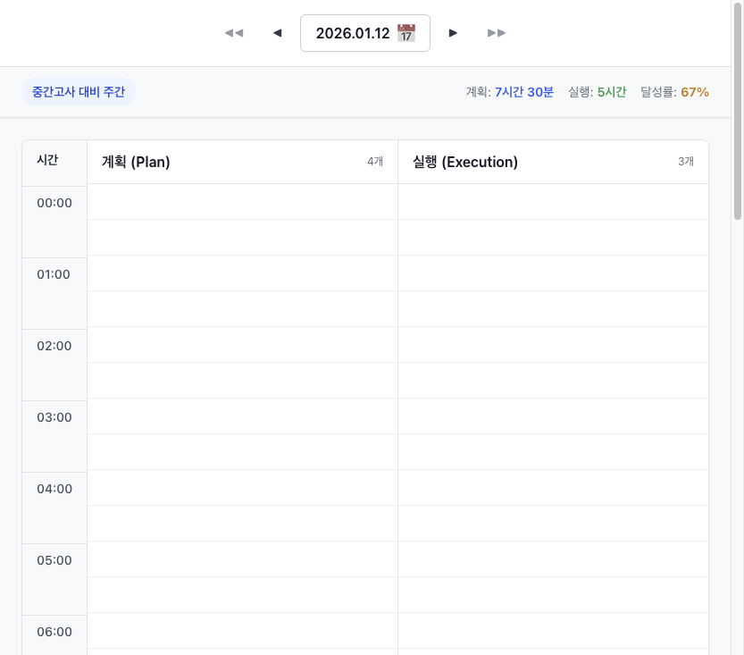
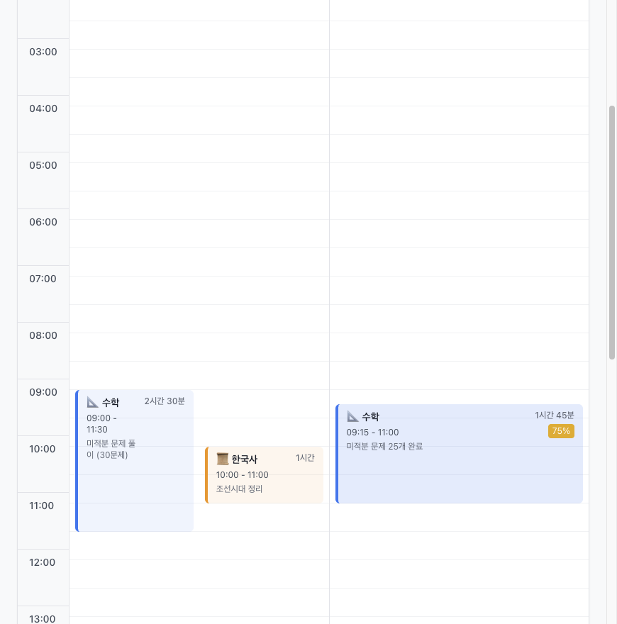

# Learning Scheduler

학습 계획과 실행을 시각적으로 관리하는 타임라인 기반 웹 애플리케이션

## 📋 프로젝트 개요

Learning Scheduler는 하루 단위로 학습 계획을 세우고 실행 기록을 타임라인으로 관리하는 애플리케이션입니다.
Plan(계획)과 Execution(실행)을 분리하여 계획 대비 실행 결과를 시각적으로 비교할 수 있습니다.

## 📸 스크린샷

### 헤더 영역 (Phase 4 완료)


**Section 1: 날짜 네비게이션**
- ◀◀ 오늘로 이동 버튼
- ◀ 이전 날짜 / ▶ 다음 날짜
- 날짜 표시 + 캘린더 버튼 (클릭 가능)
- 날짜 변경 시 타임라인 자동 갱신

**Section 2: 통계 정보**
- 좌측: 대표 일정 Chip (파란색 배경, 둥근 모서리)
- 우측: 계획/실행 시간 및 달성률
  - 계획: 7시간 30분 (파란색)
  - 실행: 5시간 (초록색)
  - 달성률: 67% (조건부 색상)

### 일정 (블록 겹침 처리)


**특징:**
- 시간이 겹치는 블록(수학, 한국사) 자동 수평 배치
- 과목별 색상 및 아이콘 표시
- 블록 hover 시 그림자 효과
- 리사이즈 핸들 (상/하단)

**달성률 배지:**
- 🟢 80% 이상: 녹색
- 🟡 50-79%: 노란색
- 🔴 50% 미만: 빨간색

## 🛠 기술 스택

### Frontend
- **React.js 18** + **TypeScript**
- **Vite** - 빌드 도구
- **Tailwind CSS** - 스타일링
- **React Router** - 라우팅

### 아키텍처
- **Feature-Sliced Design (FSD)** - 확장 가능한 모듈형 아키텍처

## 📁 프로젝트 구조

```
src/
├─ app/                 # 앱 초기화 및 Provider
│   ├─ providers/       # Theme, Settings Provider
│   ├─ routes/          # 라우팅 설정
│   └─ App.tsx
│
├─ pages/               # 페이지 컴포넌트
│   └─ DayTimelinePage/ # 하루 타임라인 화면
│
├─ widgets/             # 복합 UI 컴포넌트
│   └─ Timeline/        # 타임라인 위젯
│
├─ features/            # 기능 모듈
│   ├─ plan/            # 계획 관련
│   ├─ execution/       # 실행 관련
│   └─ schedule-edit/   # 드래그/리사이즈 등 편집 기능
│
├─ entities/            # 비즈니스 엔티티
│   ├─ subject/         # 과목
│   └─ date-event/      # 대표 일정
│
└─ shared/              # 공통 모듈
    ├─ ui/              # 공통 UI 컴포넌트
    ├─ lib/             # 유틸리티 함수
    └─ types/           # 공통 타입 정의
```

## 🚀 시작하기

### 1. 의존성 설치

```bash
npm install
```

### 2. 개발 서버 실행

```bash
npm run dev
```

브라우저에서 `http://localhost:5173` 접속

### 3. 빌드

```bash
npm run build
```

### 4. 빌드 미리보기

```bash
npm run preview
```

## 🎯 주요 기능

### ✅ 완료된 기능 (Phase 1-4)

#### Phase 1-3: 기본 타임라인 & 인터랙션
- **타임라인 뷰**: 24시간 그리드, Plan/Execution 2열 구조
- **시간 겹침 처리**: 동일 시간대 블록 자동 수평 배치
- **블록 생성**: 빈 공간 드래그로 새 블록 생성
- **블록 이동**: 드래그 앤 드롭으로 시간 변경
- **블록 리사이즈**: 상단/하단 핸들로 시작/종료 시간 조정
- **10분 스냅**: 모든 인터랙션에 10분 단위 스냅 적용

#### Phase 4: 헤더 & 날짜 네비게이션 ✨ NEW
- **2섹션 헤더 구조**:
  - Section 1: 날짜 네비게이션 (◀◀ ◀ 날짜+캘린더 ▶ ▶▶)
  - Section 2: 통계 정보 (대표일정 Chip + 계획/실행/달성률)
- **날짜 상태 관리**: Date 객체 기반 상태 관리
- **화살표 버튼**: 이전/다음 날짜 이동, 오늘로 이동
- **대표 일정 Chip**: 파스텔 배경, 둥근 모서리 (16px)
- **통계 정보**: 계획/실행 시간, 달성률 (조건부 색상)

#### 시각화 & UX
- **과목별 색상/아이콘**: 과목마다 고유 색상 및 이모지 아이콘
- **달성률 배지**: 🟢 80%+, 🟡 50-79%, 🔴 50% 미만
- **Mock API**: JSON 기반 데이터 로딩

### 🚧 향후 구현 예정

#### Phase 5: 캘린더 위젯 (고난이도 7/10)
- 날짜 클릭 시 캘린더 팝업
- 월 선택 UI
- 데이터 있는 날짜 점 표시 (계획/실행 구분)
- 빠른 날짜 이동

#### Phase 6: 비교 & 달성률
- Plan-Execution 연결 로직
- 미실행 계획 표시 (흐림 + 점선)
- 달성률 자동 계산 및 배지

#### Phase 7: 모바일 대응
- 좌우 스와이프 날짜 이동
- 터치 영역 최적화
- WebView 제스처 충돌 처리

#### Phase 8: 백엔드 (Optional)
- FastAPI 서버 구축
- REST API 엔드포인트
- 데이터 영속성

## 📐 설계 원칙

1. **관심사 분리**: FSD 아키텍처로 계층별 명확한 역할 구분
2. **타입 안정성**: TypeScript로 컴파일 타임 에러 방지
3. **재사용성**: shared/lib에 공통 로직 집중
4. **확장성**: 기능별 독립적인 모듈 구조

## 🎨 UI/UX 특징

- Tailwind CSS 기반 모던한 디자인
- 반응형 레이아웃
- 직관적인 타임라인 인터페이스
- 과목별 색상 구분
- WebView 호환 (향후 모바일 앱 지원)

## 📝 Mock 데이터

초기 개발 단계에서는 `public/mock/data.json` 파일의 Mock 데이터를 사용합니다.

### 데이터 구조

```json
{
  "subjects": [
    {
      "id": "subject-1",
      "name": "수학",
      "color": "#3B82F6",
      "icon": "📐"
    }
  ],
  "dateEvents": [
    {
      "id": "event-1",
      "date": "2026-01-12",
      "title": "중간고사 대비 주간",
      "isRepresentative": true
    }
  ],
  "plans": [
    {
      "id": "plan-1",
      "date": "2026-01-12",
      "startTime": "09:00",
      "endTime": "11:30",
      "subjectId": "subject-1",
      "memo": "미적분 문제 풀이"
    }
  ],
  "executions": [
    {
      "id": "execution-1",
      "date": "2026-01-12",
      "startTime": "09:15",
      "endTime": "11:00",
      "subjectId": "subject-1",
      "achievement": 75
    }
  ]
}
```

향후 FastAPI 백엔드와 연동 시 동일한 데이터 구조를 유지합니다.

## 🔧 개발 가이드

### Path Alias 사용

```typescript
import { Button } from '@/shared/ui';
import { timeToPixel } from '@/shared/lib';
import { Plan } from '@/features/plan';
```

### 컴포넌트 작성 규칙

- 함수형 컴포넌트 사용
- Props는 인터페이스로 정의
- Tailwind CSS 클래스 사용 (인라인 스타일 지양)
- 비즈니스 로직은 커스텀 훅으로 분리

### 주요 커스텀 훅

**데이터 관리:**
- `useTimelineData(date)` - 날짜별 타임라인 데이터 로딩

**레이아웃:**
- `useOverlapLayout(blocks)` - 겹치는 블록 레이아웃 계산

**인터랙션:**
- `useCreate()` - 빈 영역 드래그로 블록 생성
- `useMove()` - 블록 드래그 이동
- `useResize()` - 블록 리사이즈
- `useSnap()` - 스냅 기능 (10분 단위)

### 주요 유틸리티 함수

**시간 계산 (`@/shared/lib/time`):**
```typescript
timeToPixel(time: string): number      // "09:00" → 360px
pixelToTime(pixel: number): string     // 360px → "09:00"
getMinutesDifference(start, end): number
formatDuration(minutes: number): string // 90 → "1시간 30분"
```

**겹침 계산 (`@/shared/lib/overlap`):**
```typescript
isOverlapping(block1, block2): boolean
calculateOverlapLayout(blocks): Layout[]
```

### 커밋 컨벤션

- `feat:` 새로운 기능
- `fix:` 버그 수정
- `refactor:` 리팩토링
- `style:` 스타일 변경
- `docs:` 문서 수정
- `test:` 테스트 추가/수정

## 📄 라이선스

MIT License

## 👥 기여

이슈와 PR은 언제나 환영합니다!
